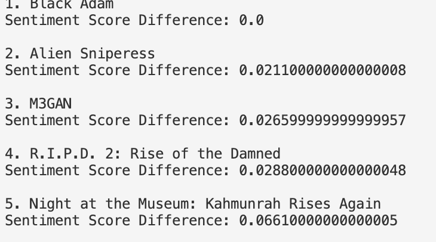

- Dataset: [TMDB.csv - 10000 movies dataset](https://www.kaggle.com/datasets/sunayanagawde/tmdb-popular-10000-movies-dataset?select=TMDB.csv)]
  Download from Kaggle
- Setup:
  Installations:
   pip install pandas
   pip install vaderSentiment
- How to run (on terminal):
   python get_recommendations.py "&lt;Prompt&gt;"
- Results:
  Prompt is "I like thrilling movies"
  Sample output:
  
